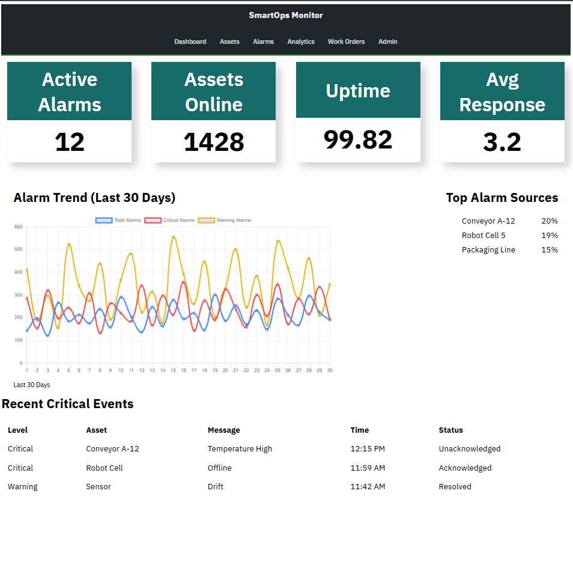

# SmartOps Monitor   [](https://github.com/corykochwork-alt/SmartOps/actions/workflows/build.yml)

SmartOps Monitor is an Angular application for monitoring operational health across industrial assets. It brings alarms, asset status, analytics, notifications, and work-order workflows into one browser-based operations console.

## Dashboard Tour

The dashboard is the starting point for a quick health check. It combines:

- **KPI cards** for active alarms, assets online, uptime, and average response time.
- **Alarm trend chart** showing total, critical, and warning alarms over the last 30 days.
- **Top alarm sources** highlighting the assets or areas generating the most alarms.
- **Recent critical events** with severity, asset, message, time, and resolution status.



## Application Areas

The primary navigation is organized around the workflows an operations team uses most often:

| Area | Purpose |
| --- | --- |
| Dashboard | Review current operational health and recent alarm activity. |
| Assets | Browse and monitor connected equipment. |
| Alarms | Investigate active and historical alarm conditions. |
| Analytics | Explore operational trends and performance data. |
| Work Orders | Track maintenance work and follow-up actions. |
| Notifications | Review operational notifications. |
| Admin | Manage administrative settings. |

## Project Structure

```text
src/app/
├── core/                 # Shared authentication and current-user state
├── features/             # Domain areas and their pages
│   └── dashboard/        # Dashboard page, components, models, API, and state
└── layout/               # Main layout, side navigation, top navigation, and footer
```

The dashboard feature is split into focused components for KPI cards, alarm trends, recent alarms, and top assets. Its models, service, and store keep display logic separate from the page shell.

## Getting Started

Install dependencies and start the development server:

```bash
npm install
npm start
```

Open `http://localhost:4200/` in a browser. Angular will rebuild and reload the application as source files change.

## Development Commands

| Command | Description |
| --- | --- |
| `npm start` | Start the local development server. |
| `npm run build` | Create a production build in `dist/`. |
| `npm test` | Run unit tests with Vitest. |
| `npm run watch` | Rebuild continuously using the development configuration. |

## Tech Stack

- Angular 21 with standalone components and Angular Router
- TypeScript
- Chart.js with `ng2-charts`
- RxJS
- Vitest and JSDOM for unit testing
